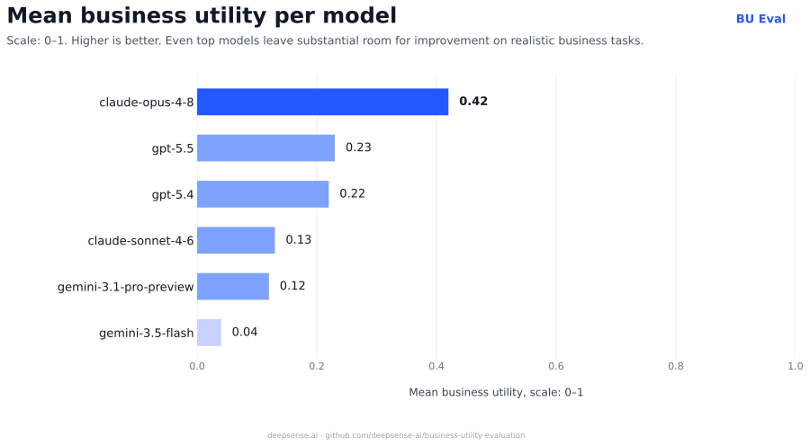
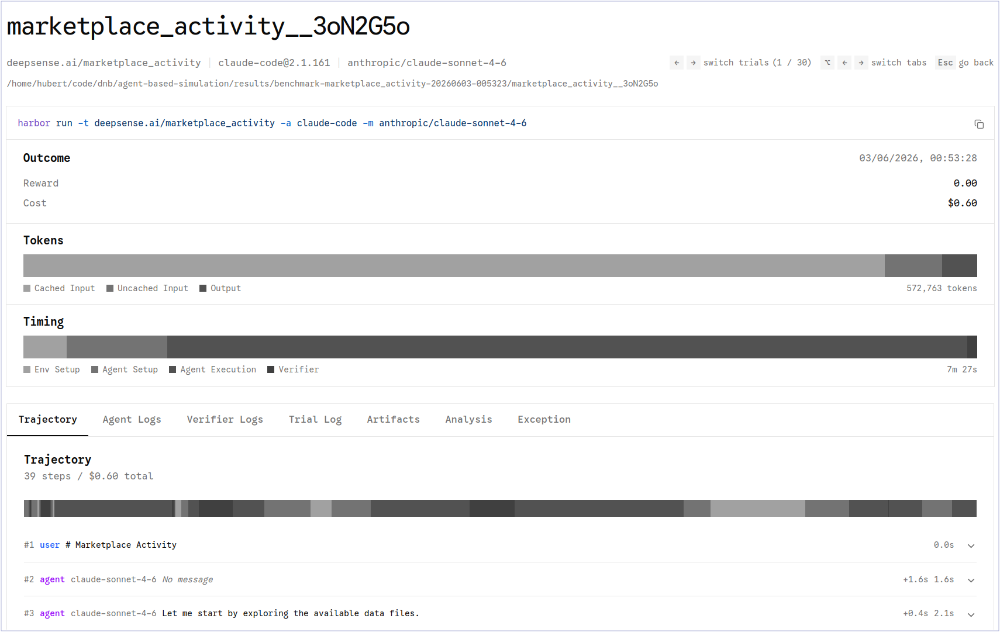

[](https://creativecommons.org/licenses/by-nc-nd/4.0/)

<div align="center">

# Business Utility Evaluation

### Synthetic Data & Evaluation Methods for Enterprise-Ready Agentic AI

**A benchmark and 5 example datasets from synthetic business simulations for testing whether AI agents can deliver reliable, repeatable, business-relevant analytical value — not just plausible answers.**

[Latest leaderboard](#leaderboard) · [Available datasets](#available-example-datasets) · [Open `tasks/`](./tasks) · [Benchmark overview](#benchmark-overview) · [Related work](#related-work) · [Run it locally](#run-the-benchmark) · [Work with us](#work-with-us)

</div>

---

## Why this repository exists

AI models are rapidly evolving from chatbots into **agents**: systems that reason through multi-step tasks, work with data, make decisions, and support enterprise workflows.

For businesses, this shift creates a new question:

> **Can an AI agent produce outputs that are not only correct, but also useful, repeatable, and reliable enough for real business deployment?**

Most benchmarks focus on accuracy, completion, or isolated task performance. In enterprise settings, that is not enough. A model may solve a task once, but fail when the same type of task is repeated. It may produce a technically plausible answer that is not useful for decision-making. It may perform well on average, but behave too unpredictably to reduce operational cost or risk.

**Business Utility Evaluation** is designed to test that gap.

This repository contains an open example of our approach to evaluating models and agents in realistic analytical business scenarios. It demonstrates how synthetic tasks, business simulations, and deployment-oriented metrics can be used to assess whether AI systems are ready for real enterprise work.

This repo includes **5 publicly available example datasets generated from business simulations**. They are intentionally small and accessible, so AI labs, researchers, and enterprise AI teams can quickly inspect the benchmark structure, run evaluations, and understand the type of custom datasets we can build at larger scale.

---

## Leaderboard (2026.06.03)

The latest benchmark results are shown below. They give a quick view of how current models compare when evaluated not only for analytical quality, but also for repeatability across runs.



Detailed trajectories, outputs, reports, and artifacts are available in the [`results`](./results) directory.

> The public dataset is intentionally limited in size and difficulty. Custom datasets for AI labs can be scaled and tuned to specific requirements, including task complexity, volume, and delivery format.

---

## Available example datasets

This repository contains **5 publicly available example datasets generated from synthetic simulations of real business processes**. You can inspect them directly in the [`tasks/`](./tasks) directory.

| Dataset | Simulated business process |
|---|---|
| [`bottleneck_employees`](./tasks/bottleneck_employees) | Identifying operational bottlenecks created by employee-level capacity constraints. |
| [`machinery_malfunctions`](./tasks/machinery_malfunctions) | Diagnosing production issues caused by machinery failures and process disruptions. |
| [`marketplace_activity`](./tasks/marketplace_activity) | Analyzing marketplace behavior, activity patterns, and business-relevant signals. |
| [`sales_representatives`](./tasks/sales_representatives) | Evaluating sales performance and identifying representatives or patterns that require attention. |
| [`supply_chain`](./tasks/supply_chain) | Reasoning about supply-chain behavior, constraints, disruptions, and downstream impact. |

These datasets are not abstract puzzles. Each problem is built around a **business simulation** that produces realistic data. The evaluated model receives this data and must analyze it, reason over the business context, and return an answer that would be valuable in a real decision-making workflow.

In other words, the benchmark tests whether a model can act like an analytical business agent: read the available data, understand what matters, identify the right signals, and produce a concise, structured, business-useful response.

These public datasets are examples of our methodology. For AI labs, we can create larger, harder, domain-specific datasets with custom simulators, controlled difficulty levels, and evaluation criteria matched to the capabilities being trained or tested.

---

## What we offer

At **deepsense.ai**, we help AI labs build better models for agentic AI by providing:

- **custom synthetic datasets** for evaluation and training,
- **business-oriented benchmark tasks** based on realistic simulations,
- **evaluation methods** focused on usefulness, reliability, and repeatability,
- **simulation environments** for multi-step reasoning and analytical decision-making,
- **delivery formats** adapted to each lab’s internal workflow.

Our datasets are designed for labs building frontier models, agentic systems, and other AI systems that need to perform reliably in enterprise environments.

We specialize in data analysis and business reasoning tasks, including:

- exploratory data analysis,
- decision-support workflows,
- multi-step reasoning over structured and semi-structured data,
- realistic business simulations.

This repository is a public example of that work: it contains 5 example datasets from synthetic business simulations, benchmark code, evaluation results, and reproducible run instructions.

---

## Why synthetic data matters

Synthetic datasets are especially valuable for model evaluation because they can be designed, controlled, and regenerated.

Our synthetic datasets are:

- **original** — not scraped, repackaged, or lightly transformed from existing sources,
- **controlled** — generated from simulators where difficulty, structure, and constraints can be adjusted,
- **realistic** — based on business contexts and analytical workflows that mirror enterprise use cases,
- **evaluation-ready** — created with clear expected outputs, scoring logic, and failure definitions,
- **customizable** — adapted to the capabilities an AI lab wants to evaluate or improve.

Because we build the simulators behind the data, we can control task complexity and generate datasets ranging from simple diagnostic checks to complex, multi-step business reasoning challenges.

---

## Benchmark overview

**Business Utility Evaluation**, or **BU Eval**, is an agent-based simulation benchmark for testing whether LLMs and VLMs are ready for deployment in real analytical workflows.

The benchmark places a model inside a realistic business task. The model must analyze data, reason through the problem, and produce a structured answer that can be compared with a ground truth.

Unlike benchmarks that measure only correctness, BU Eval introduces a deployment-oriented metric:

> **Business utility** — a risk-adjusted score that rewards analytical quality and penalizes instability across repeated runs.

This matters because enterprise users do not only need a model that can produce a good answer once. They need systems that behave consistently enough to support trust, reduce verification cost, and make AI adoption economically viable.

---

## What the problems look like

The benchmark problems are **simulations of real business processes**. A simulator generates data that resembles the kind of information an organization would collect in daily operations: sales records, supply-chain events, marketplace activity, machine behavior, employee capacity, failures, delays, or other business signals.

The model is then asked to work with this data as an analytical agent. Its task is not to answer a trivia question or solve a puzzle benchmark. Its task is to:

1. inspect the generated business data,
2. infer what is happening in the simulated process,
3. identify the business-relevant pattern, anomaly, bottleneck, or decision point,
4. return a structured answer that can be compared with ground truth,
5. do this reliably across repeated runs.

This makes BU Eval useful for testing capabilities that matter in enterprise agentic AI: data analysis, business reasoning, repeatability, and the ability to produce answers that are operationally useful rather than merely plausible.

---

## What this benchmark evaluates

BU Eval focuses on three practical questions:

### 1. Does the model produce useful analytical output?

The benchmark measures whether the model’s answer matches the expected business-relevant result, not just whether the reasoning sounds plausible.

### 2. Is the model repeatable?

Each model is evaluated across multiple trajectories per problem. This makes it possible to detect models that sometimes perform well but are too unstable for operational use.

### 3. Does the model create business value under uncertainty?

The `Business utility` metric combines average analytical quality with repeatability. A model that is accurate but highly variable receives a lower utility score than a model that is both accurate and stable.

---

## Evaluation method

The benchmark reports the following descriptors:

| Metric | Meaning |
|---|---|
| `ms` | Mean score, based on the Jaccard index. Used as an estimate of average analytical quality. |
| `CoV` | Coefficient of variation. Used to capture relative instability across repeated trajectories. |
| `Business utility` | Risk-adjusted score combining average quality and repeatability. |

`Business utility` is defined as: `Business utility = ms * exp(-2.25 * CoV^0.88)`

The instability parameters are adapted from the loss-side parametrization used in prospect theory. They provide a practical way to express the idea that reduced repeatability should lower perceived usefulness in a nonlinear way.

The goal is to summarize a deployment-oriented intuition:

> A model is more useful when it is both accurate on average and sufficiently repeatable to support trust in repeated use.

In this benchmark, `Business utility` is bounded between `0` and `1`.

The benchmark does not define a universal deployment threshold. Acceptable utility depends on the organization’s risk tolerance, verification cost, and operational requirements.

---

## How scoring works

Each model is evaluated on **five trajectories per problem**.

For each trajectory:

- the model must produce an answer in the expected JSON format,
- the answer is compared with one ground truth dictionary,
- the trajectory score is calculated using the Jaccard index,
- failed trajectories receive a score of `0.0`.

A trajectory is treated as failed if:

- it does not produce a JSON answer file in the expected format, or
- it reaches the timeout limit of `3600` seconds.

All models are evaluated using their provider-specific harness, for example Claude Code for Anthropic models. Harnesses use the default setup, without custom instructions such as `agents.md`. Models are evaluated with their default temperature settings and with the highest available reasoning-effort variant, such as `high` or `xhigh`, where applicable.

---

## Models

Model names follow the naming used by [LiteLLM](https://models.litellm.ai/).

The model, agent, and reasoning-effort configuration used in the benchmark is stored in:
[`harbor/model-benchmark.yaml`](./harbor/model-benchmark.yaml)

Example configuration:

```yaml
- model_name: anthropic/claude-opus-4-8
  name: claude-code
  reasoning_effort: xhigh

- model_name: anthropic/claude-sonnet-4-6
  name: claude-code
  reasoning_effort: xhigh

- model_name: openai/gpt-5.5
  name: codex
  reasoning_effort: xhigh

- model_name: openai/gpt-5.4
  name: codex
  reasoning_effort: xhigh

- model_name: google/gemini-3.1-pro-preview
  name: gemini-cli
  reasoning_effort: high

- model_name: google/gemini-3.5-flash
  name: gemini-cli
  reasoning_effort: high
```

---

## Repository structure

```text
.
├── harbor/                  # Benchmark configuration and Harbor setup
├── results/                 # Evaluation results, trajectories, and artifacts
├── tasks/                   # 5 example datasets from synthetic business simulations
├── Makefile                 # Convenience commands for running the benchmark
└── README.md                # Benchmark documentation and landing page
```

---

## Run the benchmark

BU Eval uses [Harbor](https://github.com/harbor-framework/harbor) as the framework for creating and running problems.

### Requirements

- Python `3.12+`
- [`uv`](https://docs.astral.sh/uv/) installed system-wide
- GNU Make
- Docker
- API keys for the model providers you want to evaluate

### Quick start

Initialize the environment:

```bash
make init
```

Fill in the API keys in:

```text
harbor/.env
```

Run a simple test:

```bash
make run TASK=sales_representatives AGENT=codex MODEL=openai/gpt-5.5
```

Run a full benchmark for one task:

```bash
make run-benchmark TASK=sales_representatives
```

To open the results viewer, run `make ui` then click the link to local server that will be given.

<div align="center">

</div>

---

## Make commands

| Command                                                                   | Description |
|---------------------------------------------------------------------------|---|
| `make init`                                                               | Installs Harbor dependencies and creates `harbor/.env` from the template if it does not exist. |
| `make env TASK=sales_representatives`                                     | Opens an interactive Docker environment for a problem. |
| `make test TASK=sales_representatives`                                    | Runs the problem with the oracle agent using one attempt and executes the reference solution. |
| `make run TASK=sales_representatives MODEL=openai/gpt-5.5 AGENT=opencode` | Runs one model and agent on one problem using one attempt, then appends a report to `results.csv`. |
| `make run-benchmark TASK=sales_representatives`                           | Runs every model entry from `harbor/model-benchmark.yaml` on one problem. |
| `make run-benchmark-all-tasks`                                            | Runs the benchmark configuration across all valid problems in `tasks/`. |
| `make ui`                                                                 | Opens the Harbor results viewer for `results/`. |


---

## Related work

We describe the benchmark's `Business Utility` approach in more detail in [the separate repository](https://github.com/deepsense-ai/agent-based-simulation-benchmark) and in [the research paper](https://arxiv.org/abs/2606.00051).

---

## Work with us

This open repository shows a small example of our synthetic data and evaluation methodology.

For AI labs, we can deliver custom datasets and evaluation environments tailored to specific model-development needs.

We can help you answer questions such as:

- How well does your model perform on realistic enterprise analytical tasks?
- Is performance stable across repeated runs?
- Which capabilities fail under multi-step business reasoning?
- How does model usefulness change as task difficulty increases?
- Can synthetic data improve training, evaluation, or post-training workflows?
- How long does a benchmark remain useful as model capabilities improve?

Depending on your needs, we can deliver:

- raw synthetic datasets,
- benchmark repositories,
- simulation functions that generate new tasks,
- custom evaluation methods,
- model evaluation reports,
- integration with your internal evaluation pipeline.

To discuss a custom dataset or evaluation project, contact us at:

```text
contact@deepsense.ai
```

---

## License

This dataset is licensed under the [**Creative Commons Attribution-NonCommercial-NoDerivatives 4.0 International License** — **CC BY-NC-ND 4.0**](https://creativecommons.org/licenses/by-nc-nd/4.0/).

You may share the dataset in its original, unmodified form, provided that proper attribution is given.

You may not modify, transform, or build upon the dataset.

Commercial use of the dataset is not permitted.

For commercial licensing inquiries, contact:

```text
contact@deepsense.ai
```

---

<div align="center">

**Synthetic data and evaluation methods for the next generation of enterprise AI agents.**

Built by [deepsense.ai](https://deepsense.ai/)

</div>
