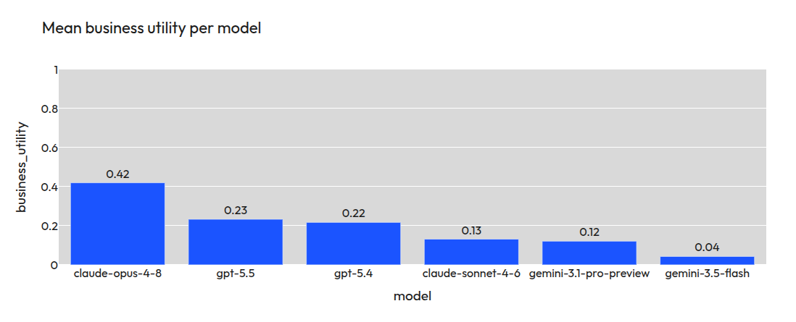

[](https://creativecommons.org/licenses/by-nc-nd/4.0/)

# Business Utility Evaluation (BU Eval) 

## Description

*BU Eval* is a business case agent-based simulation benchmark for testing whether LLMs are ready for deployment in real analytical workflows. *BU Eval* consists of agent-based business simulations in which an LLM/VLM must operate in a realistic, analytical setting and demonstrate its ability to deliver business-relevant value. Instead of measuring only problem completion or answer correctness, *BU Eval* introduces a dedicated `Business utility` metric. This evaluates whether the model’s output is not just technically plausible, but actually useful from a business perspective.

## Leaderboard
(2026.06.03)



The results of particular trajectories along with artifacts can be found in folder `results`.

## Method

The benchmark reports following descriptors:

- `ms`: mean score (Jaccard index), used as the estimate of average analytical quality
- `CoV`: coefficient of variation, used to capture relative instability
- `Business utility`: a risk-adjusted summary that combines quality and repeatability

`Business utility` is defined as: `ms * exp(-2.25 * CoV^0.88)`

The instability parameters in this formulation are adapted from prospect theory, specifically from the loss-side parametrization used to represent nonlinear sensitivity to losses. They are used as a practical way to express the idea that reduced repeatability should lower perceived usefulness in a nonlinear rather than purely proportional way. The purpose of this metric is to summarize a deployment-oriented intuition in a single quantity: a model is more useful when it is both accurate on average and sufficiently repeatable to support trust in repeated use.

In this benchmark, `Business utility` is bounded between `0` and `1`. However, the benchmark does not define a universal threshold for what level of utility should count as acceptable for deployment. That judgment is left open because acceptable utility depends on managerial risk tolerance, verification costs, and the practical demands of a specific organizational setting.

Each model was evaluated on five trajectories per problem. The score for each trajectory is the Jaccard index, where the answer and ground truth are dictionaries. There is only one ground truth for each problem. If a trajectory failed, it was scored as `0.0`. A failed trajectory is defined as one that either did not produce a JSON answer file in the expected format or reached the timeout of 3600 seconds. All models were run with their provider-specific harness, for example, Claude Code for Anthropic models. The harness used the default setup, without any custom instructions such as `agents.md`. All models were evaluated with their default temperature settings. Each model was evaluated in its highest reasoning-effort variant, high or xhigh, if present.

## Related work
We describe the benchmark's `Business Utility` approach in more detail in [the separate repository](https://github.com/deepsense-ai/agent-based-simulation-benchmark) and in [the research paper](https://arxiv.org/abs/2606.00051).

## Models

Names of models are taken from [Litellm](https://models.litellm.ai/).

Models, agents (harness) and reasoning effort configuration used in our evaluation:

```
- model_name: anthropic/claude-opus-4-8
  name: claude-code
  reasoning_effort: xhigh

- model_name: anthropic/claude-sonnet-4-6
  name: claude-code
  reasoning_effort: xhigh

- model_name: openai/gpt-5.5
  name: codex
  reasoning_effort: xhigh

- model_name: openai/gpt-5.4
  name: codex
  reasoning_effort: xhigh

- model_name: google/gemini-3.1-pro-preview
  name: gemini-cli
  reasoning_effort: high

- model_name: google/gemini-3.5-flash
  name: gemini-cli
  reasoning_effort: high
```

The list is saved in `harbor/model-benchmark.yaml`


## Technical details

### Start

We are using [harbor](https://github.com/harbor-framework/harbor) as the framework for creating and running problems.

Requirements:
- python ver 3.12+
- [uv](https://docs.astral.sh/uv/) installed system wide
- GNU make
- Docker

If you want to run the problems yourself:

1. Initialize the python venv environment: `make init`
2. Fill out the API keys of LLM providers that will be used in `harbor/.env`.
  
3. Run a simple test: `make test TASK=sales_representatives AGENT=openai/gpt-5.5`
4. Run a full benchmark for a single problem: `make test TASK=sales_representatives`
5. Run `make ui` for viewing the results

### Make Commands

The Makefile wraps common Harbor workflows:

- `make init` installs Harbor dependencies and creates `harbor/.env` from the template if it does not exist.
- `make env TASK=sales_representatives` opens an interactive Docker environment for a problem.
- `make test TASK=sales_representatives` runs the problem with the oracle agent using one attempt, which executes the reference solution.
- `make run TASK=sales_representatives MODEL=openai/gpt-5.5` runs one model and agent on one problem using one attempt, then appends a report to the problem's `results.csv`. Override `AGENT` if needed.
- `make run-benchmark TASK=sales_representatives` runs every model entry from `harbor/model-benchmark.yaml` on one problem, using the config's attempt/concurrency settings, then appends report rows.
- `make run-benchmark-all-tasks` runs the benchmark config across all valid problem in `tasks/`, using the config's attempt/concurrency settings, then appends report rows.
- `make ui` opens the Harbor results viewer for `results/`.

Reportable targets create a known Harbor job directory with `RESULTS_DIR` and `JOB_NAME`, then run `harbor/job_report.py` after Harbor succeeds. Use `REPORT=0` to skip automatic reporting.

Examples:

- `make run TASK=sales_representatives MODEL=openai/gpt-5.5`
- `make run-benchmark TASK=sales_representatives`
- `make run-benchmark TASK=sales_representatives EXTRA='-k 2 -n 3'`
- `make run-benchmark TASK=sales_representatives JOB_NAME=my-run`
- `make run-benchmark TASK=sales_representatives REPORT=0`

Benchmark targets use `n_attempts` and `n_concurrent_trials` from `harbor/model-benchmark.yaml` by default. Use `EXTRA='-k 2 -n 3'` only for one-off attempt/concurrency overrides.

Use `EXTRA='...'` to append ad-hoc Harbor flags, for example `EXTRA='--ak reasoning_effort=xhigh'`. Do not pass `--jobs-dir` or `--job-name` through `EXTRA`; use `RESULTS_DIR` and `JOB_NAME` instead.

## License
This dataset is licensed under the [Creative Commons Attribution-NonCommercial-NoDerivatives 4.0 International License (CC BY-NC-ND 4.0)](https://creativecommons.org/licenses/by-nc-nd/4.0/).
You may share the dataset in its original, unmodified form, provided that proper attribution is given.
You may not modify, transform, or build upon the dataset.
Commercial use of the dataset is not permitted.
For commercial licensing inquiries, please reach out to contact@deepsense.ai
